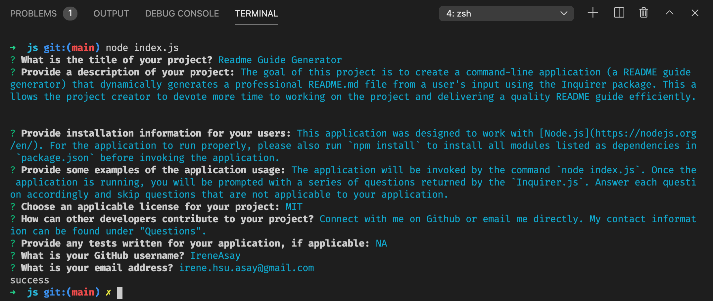
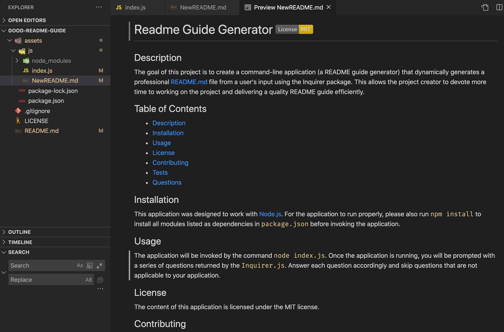

# Readme Guide Generator

## Project Description 
The goal of this project is to create a command-line application (a README guide generator) that dynamically generates a professional README.md file from a user's input using the npm Inquirer package. This allows the project creator to devote more time to working on the project and delivering a quality README guide efficiently.


## Table of Content

  - [Project Description](#project-description)
  - [User Story](#user-story)
  - [Criteria](#criteria)
  - [Installation](#installation)
  - [Usage](#usage)
  - [License](#license)


## User Story

```md
AS A developer
I WANT a README generator
SO THAT I can quickly create a professional README for a new project
```


## Criteria

```md
GIVEN a command-line application that accepts user input
WHEN I am prompted for information about my application repository
THEN a high-quality, professional README.md is generated with the title of my project and sections entitled Description, Table of Contents, Installation, Usage, License, Contributing, Tests, and Questions
WHEN I enter my project title
THEN this is displayed as the title of the README
WHEN I enter a description, installation instructions, usage information, contribution guidelines, and test instructions
THEN this information is added to the sections of the README entitled Description, Installation, Usage, Contributing, and Tests
WHEN I choose a license for my application from a list of options
THEN a badge for that license is added near the top of the README and a notice is added to the section of the README entitled License that explains which license the application is covered under
WHEN I enter my GitHub username
THEN this is added to the section of the README entitled Questions, with a link to my GitHub profile
WHEN I enter my email address
THEN this is added to the section of the README entitled Questions, with instructions on how to reach me with additional questions
WHEN I click on the links in the Table of Contents
THEN I am taken to the corresponding section of the README
```


## Installation

This application was designed to work with [Node.js](https://nodejs.org/en/). For the application to run properly, please also run `npm install` to install all modules listed as dependencies in `package.json` before invoking the application.


## Usage

The application will be invoked by the command `node index.js`. Once the application is running, you will see a series of questions prompted by the `Inquirer.js`. Answer each question accordingly and type NA or skip questions that are not applicable to your application. 



Meanwhile, `fs.writeFile` generates a **NewREADME.md** file based on the README template from the index.js file. This newly generated README file should contain all the project information you provided in responding to the questions. 



## Questions

A sample README file titled **README_sample.md** is enclosed with the application under [assets/js/README_sample.md](assets/js/README_sample.md) for your reference. You can also check out the [demo video](https://drive.google.com/file/d/1kVWFY_yALOuRJsOux_nve6n4Q-I54gSJ/view) to walk through the entire process with me.

More questions? Connect with me and we can chat more!

Github: <a href="https://github.com/IreneAsay" target="_blank">IreneAsay</a> 

Email Address: irene.hsu.asay@gmail.com


## License

© Irene Asay. All Rights Reserved. Under the [MIT/](./license.txt) license.
